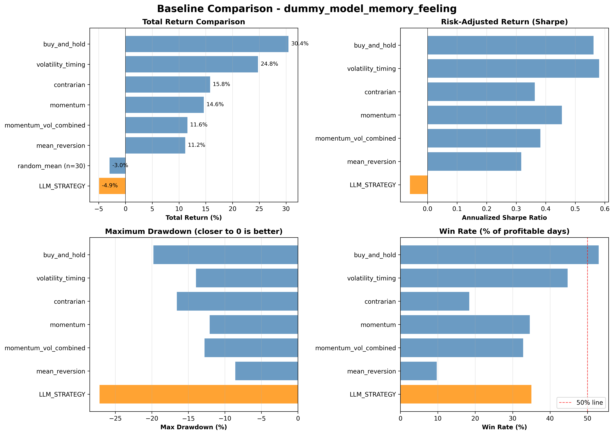
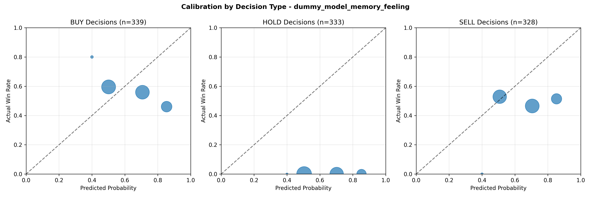
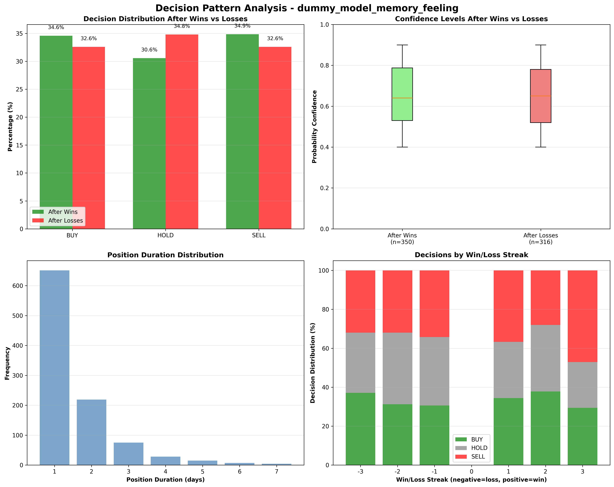
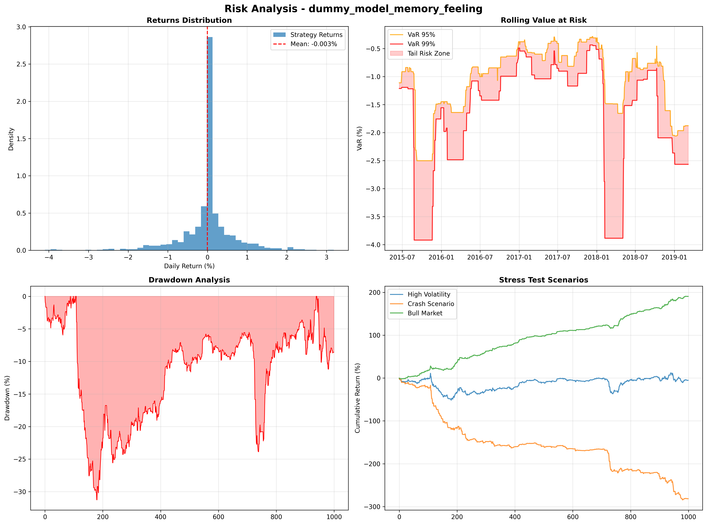
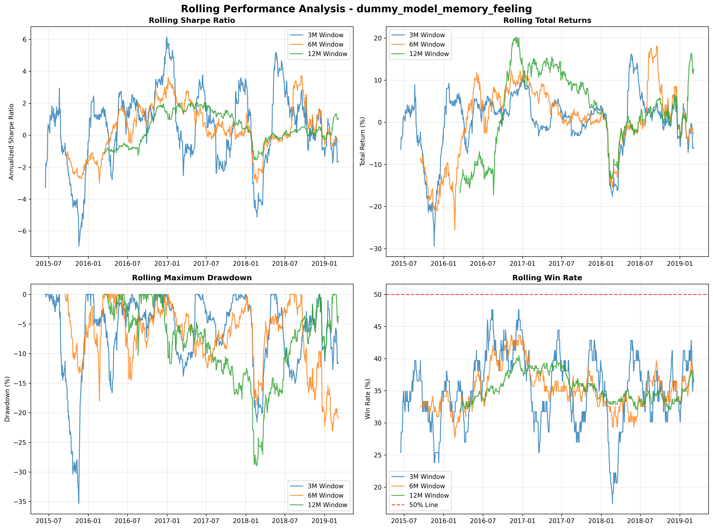
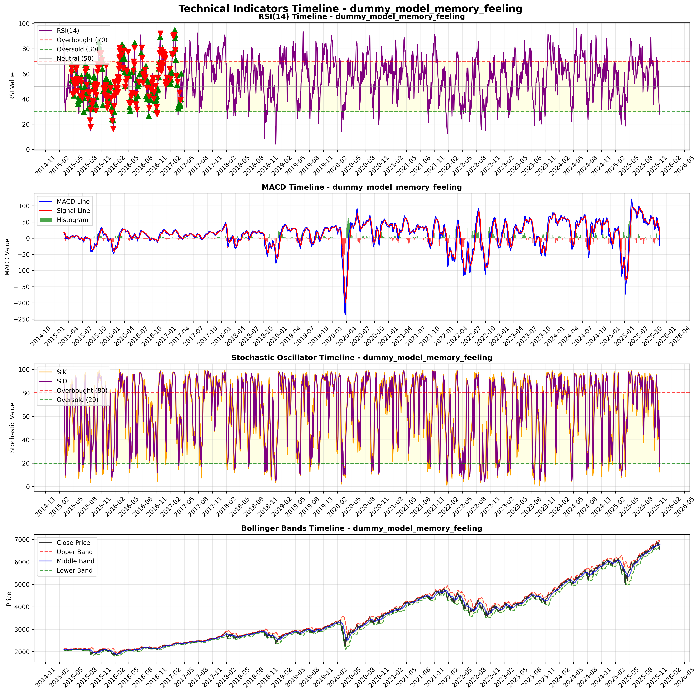

# Large Language Models in Financial Decision-Making

[](https://www.python.org/)
[](https://opensource.org/licenses/MIT)
[](CONTRIBUTING.md)
[](#research-questions)

**An empirical framework for evaluating AI agents in financial markets**

This research framework provides rigorous methodological tools to assess Large Language Model performance against established quantitative trading strategies. The framework enables systematic investigation of memory adaptation, probabilistic calibration, and behavioral patterns in AI-driven financial decision-making.

> **Note**: This is an active research project. Contributions and feedback are welcome!

---

## 🎯 What This Does

### The Trading Process
Each day, the LLM analyzes market data and **chooses one action**:
- **BUY**: Take a long position (+1.0) - profit if market goes up
- **HOLD**: Stay in cash (0.0) - no profit/loss regardless of market movement
- **SELL**: Take a short position (-1.0) - profit if market goes down

The LLM receives technical indicators, can maintain a strategic journal, and may express emotional states. Performance is rigorously compared against traditional quantitative strategies. The framework supports **dynamic symbol configuration** - automatically adapts to any configured symbol (SPY, QQQ, AAPL, etc.) instead of hardcoded "S&P 500" references.

### 🤖 Trader Personality System
The framework now supports **5 distinct trader personalities** that influence LLM decision-making:
- **Cautious**: Risk-averse, prioritizes capital preservation
- **Aggressive**: Bold, seeks alpha through active positioning
- **Balanced**: Systematic, balances risk and reward
- **Momentum**: Trend-following, capitalizes on market momentum
- **Contrarian**: Counter-cyclical, fades market sentiment extremes

Configure with: `ACTIVE_PERSONALITY = "balanced"` in `src/config.py`

### How It Works

### ⚠️ Important: Automatic Trading Start Delay

**Trading doesn't begin immediately after DATA_START!**

Due to technical indicator warm-up requirements, the system automatically skips the first ~40 trading days of your dataset. Even with `START_ROW = 0`, you'll start trading approximately 40 trading days after your configured `DATA_START` date.

**Example:** If `DATA_START = "2015-01-01"`, actual trading begins around March 2015.

---

The framework follows a systematic 5-step process:

1. **📊 Data Preparation**: Load historical market data from the committed vendored snapshot by default, or refresh from live sources when needed, then compute comprehensive technical indicators (RSI, MACD, Stochastic Oscillator, Bollinger Bands, moving averages, volatility, momentum)
2. **📝 Prompt Engineering**: Build hierarchical prompts with 4 layers of memory:
   - **System Prompt**: Fixed rules and technical indicator definitions
   - **Raw Market Data**: Current conditions and 20-day technical history
   - **Strategic Journal**: LLM's recent 10 trading decisions with explanations
   - **Memory Blocks**: Weekly/monthly summaries generated by LLM analysis
   - **Performance Summary**: Real-time metrics vs configured symbol benchmark
3. **🤖 LLM Decision Making**: Query language models through the configured provider (OpenRouter, local Claude Code, or the deterministic dummy stub) to generate BUY/HOLD/SELL decisions with confidence scores and explanations
4. **📈 Backtesting Engine**: Simulate trading performance over historical periods, tracking returns, risk metrics, and position management
5. **📋 Analysis & Reporting**: Generate comprehensive reports with statistical validation, behavioral pattern analysis, and performance comparisons

### Technical Indicator Memory System
**Comprehensive technical analysis with historical context and aggregated insights**

The framework implements a dual-layer technical indicator system for maximum analytical depth:

- **📈 Daily Historical Series**: 20-day lagged technical indicator values (RSI, MACD histogram, Stochastic %K, Bollinger Band position) in daily prompts for detailed pattern analysis
- **📊 Aggregated Memory Context**: Weekly/monthly/quarterly/yearly memory includes aggregated technical statistics (averages, percentages, ranges) for efficient token usage
- **🎯 Current Day Analysis**: Real-time RSI, MACD, Stochastic Oscillator, Bollinger Bands, Momentum, and Volatility for comprehensive decision-making
- **🧠 Multi-Timeframe Correlation**: LLMs can analyze technical signals across daily trends, weekly averages, and monthly patterns for sophisticated decision-making

### Recent Architectural Improvements 🚀

#### **Phase 3: Trading Engine Decomposition (COMPLETED)**
- **PerformanceTracker**: Extracted performance tracking logic into dedicated class
- **JournalManager**: Isolated strategic journal management with rolling window
- **TradeHistoryManager**: Centralized trading history CSV formatting
- **Impact**: Reduced `run_single_model` complexity by 29% (722→513 lines)

#### **Phase 4: Data Pipeline Optimization (COMPLETED)**
- **DataFrame Fragmentation Fix**: Eliminated 54 performance warnings
- **Batch Operations**: Replaced individual column assignments with `pd.concat()`
- **Performance**: Improved DataFrame memory efficiency
- **Impact**: 98% reduction in fragmentation warnings, faster test execution

#### **Phase 5: Chain of Thought Integration (COMPLETED)**
- **Reasoning Prompts**: Implemented structured step-by-step analytical reasoning
- **Response Parsing**: Conditional parsing based on `ENABLE_CHAIN_OF_THOUGHT` toggle
- **Master Toggle**: Chain of thought now works independently of experiment selection
- **Breaking Change**: `ENABLE_CHAIN_OF_THOUGHT = True` enables reasoning regardless of experiment type

#### **Memory System Architecture:**
```
LLM Prompt Structure:
├── System Prompt (static rules)
└── User Message (dynamic context)
    ├── Raw Technical Data
    ├── Strategic Journal (JournalManager) 🧠
    ├── Performance Summary (PerformanceTracker) 📈
    ├── Memory Blocks (MemoryManager) 🏗️
    └── Trading History (TradeHistoryManager) 📋
```

### Research Capabilities
- **🧪 Compare LLMs vs Traditional Strategies**: Test any LLM against momentum, mean-reversion, volatility timing, and other proven approaches
- **🎭 Personality Research**: Study how different behavioral frameworks (cautious, aggressive, balanced, momentum, contrarian) affect LLM trading decisions and performance consistency
- **🧠 Hierarchical Memory & Adaptation**: Study how LLMs learn from experience with multi-level memory system (daily, weekly, monthly, quarterly, yearly), strategic journals, feeling logs, and optional complete trading history
- **🎯 Calibration Analysis**: Assess if LLM confidence matches actual performance
- **🧮 Behavioral Biases**: Detect human-like trading biases in AI decisions
- **📊 Statistical Rigor**: Bootstrap testing, out-of-sample validation, risk-based HOLD evaluation

---

## 🔬 Research Objectives

### Memory and Learning Dynamics
**Investigation of temporal learning in sequential financial decisions**
- Analysis of hierarchical memory systems (daily, weekly, monthly, quarterly, yearly summaries)
- Assessment of multi-scale temporal learning and adaptation patterns
- Analysis of historical context integration in LLM decision processes
- Evaluation of adaptive behavior based on performance feedback
- Evaluation of emotional state impacts on decision quality

### Behavioral Personality Analysis
**Systematic study of how behavioral frameworks influence AI decision-making**
- Comparative analysis of 5 personality frameworks (cautious, aggressive, balanced, momentum, contrarian)
- Assessment of behavioral consistency across market regimes
- Analysis of decision pattern differences by personality type
- Evaluation of personality effects on risk management and position sizing
- Investigation of how behavioral frameworks affect learning adaptation

### Probabilistic Calibration
**Assessment of confidence-outcome alignment in AI predictions**
- Measurement of overconfidence/underconfidence patterns
- Decision-specific calibration analysis (BUY/SELL/HOLD)
- Longitudinal calibration stability assessment

### Behavioral Pattern Analysis
**Detection of systematic biases in AI trading behavior**
- Loss aversion quantification in position management
- Disposition effect identification in profit-taking behavior
- Risk management appropriateness in uncertain conditions

---

## 📊 At a Glance

| Component | Status | Description |
|-----------|--------|-------------|
| **LLM Integration** | ✅ OpenRouter API | BERT, GPT, Claude, Gemini models |
| **Memory System** | ✅ **4-Layer Hierarchical** | Journal + Periods + Performance + History |
| **Personality System** | ✅ **5 Behavioral Profiles** | Cautious, Aggressive, Balanced, Momentum, Contrarian |
| **Data Pipeline** | ✅ **Optimized** | Zero fragmentation warnings, batch operations |
| **Modular Architecture** | ✅ **29% Reduction** | Trading engine complexity reduced |
| **Baseline Strategies** | ✅ 15 Strategies | 8 Categories: Momentum, Mean Reversion, Risk Mgmt, etc. |
| **Statistical Validation** | ✅ Bootstrap Testing | Out-of-sample, significance testing |
| **Decision Analysis** | ✅ Dual-Criteria | Calibration + behavioral pattern analysis |
| **Reporting** | ✅ Enhanced Suite | 3 new sections + professional HTML styling |

---

## 🚀 Getting Started

### Modern Installation (Recommended)
```bash
# Install everything (core + development tools)
pip install -e .[dev]

# Or install core dependencies only
pip install -e .
```

### Quick Test Run
```bash
# First, validate that core mathematical calculations are correct
python scripts/validate_core_math.py

# Configure data source (default is the committed vendored snapshot)
# Edit src/config.py and set:
# DATA_SOURCE = "vendored"
# STOOQ_SYMBOL = "SPY"
# ACTIVE_PERSONALITY = "balanced"  # Choose: cautious, aggressive, balanced, momentum, contrarian
# ENABLE_CHAIN_OF_THOUGHT = True  # Enable structured analytical reasoning (independent of experiment)

# Then run with dummy model (no API key needed)
python -m src.main
```

### Development Workflow
```bash
# Run quality checks (linting, testing, type checking)
python scripts/dev-workflow.py check

# Windows users can also use:
dev check

# Linux/Mac users can also use:
make check
```

### Choosing how decisions are generated (`LLM_PROVIDER`)

One knob in `src/config.py` selects the backend. No code changes needed to switch.

```python
LLM_PROVIDER = "dummy"
# "dummy"                 -> random decisions, no API/CLI, no cost (default, for testing)
# "openrouter"            -> any model via OpenRouter HTTP API (needs OPENROUTER_API_KEY,
#                            pay per token). Best for large backtests.
# "claude_code"           -> Claude Code via your SUBSCRIPTION (no per-token cost),
#                            single-shot. Needs the claude CLI logged in on this machine.
# "claude_code_subagents" -> Claude Code subscription, multi-agent: a lead consults
#                            specialist analysts (ANALYST_AGENTS) before deciding.

CLAUDE_CODE_MODEL = "sonnet"  # used by the claude_code providers
```

#### Option A: OpenRouter (pay per token, scales to large backtests)
```bash
# 1. Get an OpenRouter API key from https://openrouter.ai/
export OPENROUTER_API_KEY="your_key_here"
# 2. In src/config.py: LLM_PROVIDER = "openrouter", then pick models in LLM_MODELS
# 3. Run
python -m src.main
```

#### Option B: Claude Code subscription (no per-token cost)
```bash
# Requires the Claude Code CLI logged in on THIS machine (OAuth in ~/.claude).
# Calls are billed to your Claude Code subscription and consume its rate limits.
# In src/config.py: LLM_PROVIDER = "claude_code"   (or "claude_code_subagents")
python -m src.main
```

**Intended use:** the Claude Code providers use the official headless CLI against
your subscription. Keep them for interactive-scale research (short windows, few
tickers, or a high-quality reference model). A full multi-year backtest = many
sequential calls (slow, heavy on rate limits); for high-volume runs use
`"openrouter"` (parallel, pay per token), which is the path intended for
programmatic backends. Web/shell/file tools are disabled on every call so the model
reasons only from the prompt (no lookahead, no side effects).

### Full run
```bash
# In src/config.py:
TEST_MODE = False  # full dataset (~2700 days) instead of TEST_LIMIT days
python -m src.main
```

### Traditional Installation (Alternative)
```bash
# Core dependencies
pip install pandas numpy scipy matplotlib requests

# Development dependencies (optional)
pip install pytest black flake8 mypy isort
```

## 🛠️ Development Tools

### Cross-Platform Commands
```bash
# Quality assurance
python scripts/dev-workflow.py check    # Full check suite
python scripts/dev-workflow.py test     # Run tests only
python scripts/dev-workflow.py lint     # Code style checks

# Version management
python scripts/version.py get           # Current version
python scripts/version.py bump patch    # Bump patch version
python scripts/version.py tag           # Create git tag

# Collaboration helpers
python scripts/collaborate.py status    # Repository status
python scripts/collaborate.py branch    # Create feature branch
python scripts/collaborate.py pr        # Prepare for PR
```

### Windows Development
```batch
dev setup     # Install all dependencies
dev check     # Run quality checks
dev test      # Run tests
dev lint      # Check code style
dev clean     # Clean build artifacts
dev collab    # Collaboration tools
```

### Linux/Mac Development
```bash
make setup    # Install all dependencies
make check    # Run quality checks
make test     # Run tests
make lint     # Check code style
make clean    # Clean build artifacts
```

### Automated Quality Assurance
Every commit is automatically checked by our CI/CD pipeline:
- ✅ **Code Linting**: flake8, black, isort
- ✅ **Type Checking**: mypy validation
- ✅ **Testing**: pytest with coverage reporting (306 tests across 31 files)
- ✅ **Import Validation**: All dependencies properly declared
- ✅ **Memory System**: Comprehensive testing of 4-layer architecture
- ✅ **Data Pipeline**: Zero fragmentation warnings verified

**⚠️ Important**: Set `TEST_MODE = False` in `src/config.py` for meaningful results, or adjust `DAYS_TO_RUN` if keeping test mode.

## 📊 Sample Results (Dummy Model)

*These are comprehensive test results from a 1000-day simulation using a dummy model - run with real LLMs for actual research!*

### Strategy Performance Comparison

*LLM strategies vs traditional approaches (dummy data for illustration)*

### Decision Calibration Analysis

*Confidence vs actual performance across BUY/HOLD/SELL decisions*

### Behavioral Pattern Analysis

*Decision changes after wins vs losses - evidence of learning/adaptation*

### Risk Analysis

*Comprehensive risk metrics including VaR, drawdowns, and stress testing*

### Rolling Performance

*Rolling Sharpe ratio and performance metrics over different time windows*

### Technical Indicators Timeline

*Evolution of RSI, MACD, Stochastic, and Bollinger Bands with trading decision overlays*

## 📈 Data Source

**Data Sources**: The framework uses a committed vendored SPY snapshot by default so fresh clones run offline and deterministically. Live refresh sources such as Stooq remain available for custom research, and custom CSV datasets are also supported for specialized work.

---

## 🏗️ Architecture

### **Hierarchical Memory System** 🧠
The framework implements a sophisticated 4-layer memory architecture enabling LLMs to maintain context across multiple timeframes:

#### **Memory Layers:**
1. **🧠 Immediate Journal** (`JournalManager`): Last 10 trades with LLM's own explanations
2. **📊 Period Summaries** (`MemoryManager`): Weekly/Monthly LLM-generated strategic analyses
3. **📈 Performance Tracking** (`PerformanceTracker`): Real-time metrics vs benchmarks
4. **📋 Trading History** (`TradeHistoryManager`): Complete chronological record

#### **Key Benefits:**
- **Self-Reflection**: LLMs read their own past reasoning and adapt
- **Multi-Timeframe Learning**: Daily, weekly, monthly, and yearly insights
- **Context Preservation**: Complete trading history for pattern recognition
- **Behavioral Continuity**: Consistent decision-making across time

### **File Structure:**

```
📁 Root Level
├── 📖 README.md               # Main project documentation
├── 📦 pyproject.toml          # Modern Python packaging & metadata
├── 📋 requirements.txt       # Core dependency list
├── 🐧 Makefile               # Unix/Linux development commands
├── 🪟 dev.bat                 # Windows development commands
├── ⚖️ LICENSE                 # Project license
├── 📝 CHANGELOG.md           # Version history & changes
└── 🤝 CODE_OF_CONDUCT.md     # Community standards

📁 src/ (Core Architecture)
├── 🎯 main.py                 # Pipeline orchestrator
├── 🔀 model_router.py         # Provider selection (LLM_PROVIDER)
├── 🤖 openrouter_model.py     # OpenRouter API integration
├── 🤖 claude_code_model.py    # Claude Code provider (local, no API cost)
├── 💾 response_cache.py       # Disk cache for LLM responses
├── 🎲 reproducibility.py      # Seed + run manifest (RUN_MANIFEST.json)
├── 📊 backtest.py            # Strategy evaluation engine
├── 🧮 baseline_runner.py     # Baseline comparison utilities
├── 🧮 baselines.py           # 15 traditional quantitative strategies
├── 📈 statistical_validation.py # Bootstrap testing + out-of-sample
├── 📋 report_generator.py    # Public facade (re-exports src/report/ package)
├── 📊 reporting/             # Runtime period summaries + charts (period_summary.py, charts.py)
├── ⚙️ config.py              # Experimental configurations
├── 🪵 logging_config.py       # Logging setup
├── 🔧 data_prep.py           # Data preprocessing (optimized)
├── 🎯 decision_analysis.py   # Decision pattern analysis
├── 🤖 dummy_model.py         # Mock model for testing
├── 📋 prompts.py             # LLM prompt templates
├── 🤖 trading_engine.py      # Main experiment orchestration

📁 src/ (Memory System Components)
├── 🧠 journal_manager.py     # Strategic journal management
├── 📊 memory_manager.py      # Period-based memory storage
├── 📊 period_manager.py      # Unified period boundary management
├── 📈 performance_tracker.py # Real-time performance metrics
├── 📋 trade_history_manager.py # Trading history CSV formatting
├── 🏗️ memory_classes.py      # Memory data structures
├── 📋 prompt_builder.py      # Prompt construction utilities

📁 src/report/ (Report Generation Package)
├── 🧩 pipeline.py            # Report orchestration entry point
├── 📄 document.py            # Master report assembly (md + HTML)
├── 📊 data_collection.py     # Gather analysis results for rendering
├── 📈 charts.py              # Report chart generation
├── 🎨 theme.py               # Shared styling/theme
└── 🧱 sections/              # Per-section renderers (executive_summary, baselines, risk, ...)

📁 src/ (Configuration System)
├── ⚙️ config_classes.py      # Type-safe configuration classes
└── 🔧 configuration_manager.py # Centralized configuration management

📁 scripts/
├── 🏷️ version.py             # Version management system
├── 🔄 dev-workflow.py        # Development automation
├── 🤝 collaborate.py         # Collaboration helpers
└── 📋 generate_report.py     # Report generation utility

📁 docs/
├── 🤝 COLLABORATION_GUIDE.md # Detailed collaboration guide
├── ⚙️ configuration.md       # Configuration reference
├── 🔬 methodology.md         # Research methodology (updated)
├── 🎲 REPRODUCIBILITY.md     # Seed, manifest, cache, vendored snapshot
└── 📚 experiment_design.md # Experiment configuration guide

📁 tests/
├── 🧪 test_calibration.py    # Calibration testing
├── 🧪 test_config_consistency.py # Configuration migration testing
├── 🧪 test_configuration.py  # Configuration system testing
├── 🧪 test_data_sources.py   # Data source management system
├── 🧪 TEST_DOCUMENTATION.md  # Test suite documentation
├── 🧪 test_dynamic_symbols.py # Dynamic symbol naming integration
├── 🧪 test_indicators.py     # Technical indicators computation
├── 🧪 test_integration.py    # End-to-end system integration
├── 🧪 test_journal_manager.py # Strategic journal management
├── 🧪 test_memory_system.py  # Memory system integration
├── 🧪 test_performance_tracker.py # Performance tracking testing
├── 🧪 test_report_generator.py # Report generation testing
├── 🧪 test_stooq_data.py     # Stooq parsing (offline mocked; live = network)
├── 🧪 test_strategic_journal_config.py # Strategic journal configuration
└── 🧪 test_trade_history_manager.py # Trading history management

📁 data/
├── 📥 raw/                   # Raw financial data (tracked)
└── 📤 processed/             # Processed data (gitignored)

📁 example_results/           # 📋 Example outputs for documentation
📁 results/                   # 📊 Generated results (gitignored)

📁 .github/
├── 🤖 workflows/ci.yml       # CI/CD pipeline
├── 🔄 dependabot.yml         # Automated dependency updates
├── 📋 PULL_REQUEST_TEMPLATE.md # PR guidelines
└── 🐛 ISSUE_TEMPLATE/         # Issue templates

📁 results/
├── 📊 analysis/              # Statistical validation JSON/CSV
├── 📈 plots/                 # Calibration, patterns, risk analysis
├── 📋 reports/               # Comprehensive experiment reports
└── 📄 parsed/                # Processed trading decisions
```

---

## 📈 Trading Strategies

### 🤖 LLM Strategy Configurations

| Configuration | Memory | Feelings | Dates | Purpose |
|---------------|--------|----------|-------|---------|
| **baseline** | ❌ | ❌ | ❌ | Pure LLM without context |
| **memory_only** | ✅ | ❌ | ❌ | Strategic journal learning |
| **memory_feeling** | ✅ | ✅ | ❌ | Emotional state tracking |
| **dates_only** | ❌ | ❌ | ✅ | Temporal awareness, no memory ⚠️ |
| **dates_memory** | ✅ | ❌ | ✅ | Temporal awareness ⚠️ |
| **dates_full** | ✅ | ✅ | ✅ | Complete context ⚠️ |

**⚠️ Research Note**: Date-enabled configurations shouldn't be used if you want to prevent data leakage from historical knowledge contamination.

### 🎯 Baseline Strategies (15 Total)
| Category | Strategy | Logic | Parameters | Status |
|----------|----------|-------|------------|--------|
| **Passive** | Buy & Hold | Passive index | - | ✅ |
| **Momentum** | Trend Following | 20-day MA | - | ✅ |
| **Momentum** | MACD Momentum | Signal crossover | Fast/Slow MACD | ✅ |
| **Momentum** | MACD Histogram | Acceleration | Histogram > 0 | ✅ |
| **Mean Reversion** | Mean Reversion | Buy dips | ±2σ thresholds | ✅ |
| **Mean Reversion** | Stochastic Oscillator | Oversold/overbought | %K <20/>80 | ✅ |
| **Mean Reversion** | Bollinger Reversion | Band breakout | Price at bands | ✅ |
| **Risk Management** | Volatility Timing | Risk management | 20% vol threshold | ✅ |
| **Multi-Factor** | Momentum + Volatility | Combined factors | MA20 + volatility | ✅ |
| **Confirmation** | MACD+RSI Combined | Dual confirmation | Both signals | ✅ |
| **Confirmation** | Stochastic+Bollinger | Dual confirmation | Both signals | ✅ |
| **Trend Following** | RSI Trend | Momentum filter | RSI 30/70 + trend | ✅ |
| **Trend Following** | RSI+MACD Combined | Dual momentum | Both signals | ✅ |
| **Contrarian** | Contrarian | Fade extremes | Inverse signals | ✅ |
| **Statistical** | Random | Statistical baseline | Equal weights | ✅ |

---

## 📊 Statistical Validation Framework

### Bootstrap Significance Testing
```python
# Rigorous statistical comparison
bootstrap_results = bootstrap_sharpe_comparison(
    llm_returns, benchmark_returns, n_bootstrap=5000
)

print(f"p-value: {bootstrap_results['p_value_two_sided']:.4f}")
print(f"95% CI: [{bootstrap_results['ci_95_bootstrap'][0]:+.3f}, {bootstrap_results['ci_95_bootstrap'][1]:+.3f}]")
```

**Key Features:**
- ✅ 5,000 bootstrap resamples for robust significance testing
- ✅ Confidence intervals account for return distribution non-normality
- ✅ Effect sizes (Cohen's d) for practical significance
- ✅ Multiple testing corrections

### Out-of-Sample Validation
```
OUT-OF-SAMPLE VALIDATION:
  Train Period: -0.060 Sharpe (750 periods: 2015-2018)
  Test Period:  -0.060 Sharpe (250 periods: 2018-2019)
  Sharpe Decay: 0.0% reduction 🚨 OVERFITTING DETECTED
  Confidence: 95% statistical validation with 5,000 bootstrap samples
```

### HOLD Decision Analysis (Dual-Criteria)
```
HOLD DECISION ANALYSIS:
Overall Success Rate: 40.4% (POOR)

Quiet Market Success (<0.2% moves): 0.6% ✅ Appropriate caution
Contextual Correctness: 100.0% ✅ Right conditions
Combined Score: 40.4% ⚠️ Too conservative overall
```

---

## 📋 Sample Results

### Performance Comparison
```
STRATEGY COMPARISON - dummy_model_memory_feeling
================================================================================
Strategy                 Return    Sharpe   MaxDD   Win%
buy_and_hold             30.5%     0.562   -33.9%   54.2
momentum                 25.8%     0.489   -25.1%   51.3
LLM_STRATEGY             -2.6%     -0.060  -45.2%   48.7 ◄
random_mean (n=30)       -15.4%     N/A     N/A     N/A
================================================================================
```

### Statistical Significance
```
BOOTSTRAP TEST VS INDEX:
  Strategy Sharpe: -0.060
  Index Sharpe: 0.562
  Difference: -0.622
  p-value: 0.384 (NOT SIGNIFICANT)
  95% CI: [-2.000, +0.754]
```

### HOLD Analysis
```
HOLD DECISION ANALYSIS
Overall HOLD Success Rate: 40.0% (GOOD)

Quiet Market Success (<0.2% Daily Moves): 40.0%
Contextual Decision Correctness: 100.0%
```

---

## 🎨 Generated Visualizations

- **📊 Baseline Comparisons**: Bar charts, equity curves
- **🎯 Calibration Plots**: Prediction accuracy, confidence analysis
- **📈 Risk Analysis**: VaR curves, drawdown timelines, stress tests
- **📋 Decision Patterns**: Win rates by scenario, position duration
- **📉 Rolling Performance**: Sharpe evolution, volatility tracking

### 📊 Enhanced Reporting System
- **📈 Baseline Strategies Section**: Comprehensive strategy showcase with 8 categories and performance tables
- **🤖 LLM Indicator Alignment**: Full 6-indicator analysis (RSI, MACD, Stochastic, Bollinger, Momentum, Volatility)
- **🎯 Strategy Comparison Insights**: LLM positioning vs traditional approaches with resemblance analysis
- **🧠 Chain of Thought Analysis**: Automatic reasoning quality metrics, performance correlations, and confidence analysis when `ENABLE_CHAIN_OF_THOUGHT = True`
- **🎨 Professional HTML Styling**: Color-coded tables, responsive design, executive highlight cards
- **📋 Executive Summary**: Framework capabilities showcase with key takeaways and advanced features

---

## 🔬 Methodology Details

### Experimental Design
- **Data**: Daily stock/index prices (customizable period and source)
- **LLM Models**: BERT, GPT, Claude, Gemini via OpenRouter API
- **Evaluation**: Bootstrap significance testing, out-of-sample validation
- **Backtesting**: Configurable assumptions and transaction costs

### Statistical Framework
- **Primary Metric**: Risk-adjusted returns (Sharpe ratio)
- **Significance Level**: p < 0.05 (bootstrap tests)
- **Validation**: Chronological train/test splits
- **HOLD Evaluation**: Dual-criteria assessment (quiet markets + context)

### Decision Analysis Pipeline
1. **LLM Response Parsing** → Decision + Probability + Explanation + Journal
2. **Calibration Assessment** → Confidence vs Reality analysis
3. **Pattern Recognition** → Behavioral pattern detection
4. **HOLD Evaluation** → Dual-criteria success assessment
5. **Statistical Validation** → Bootstrap significance testing

---

## 📖 Usage Examples

### Run Complete Experiment
```bash
# Configure in src/config.py
ACTIVE_EXPERIMENT = "memory_only"  # or "baseline", "dates_memory", etc.

# Run pipeline
python -m src.main
```

### Analyze Specific Model
```python
from src.report_generator import generate_comprehensive_report

# Generate full research report
report_path = generate_comprehensive_report("bert_memory_only")
print(f"Report saved: {report_path}")
```

### Statistical Validation
```python
from src.statistical_validation import comprehensive_statistical_validation

# Run full validation suite
validation = comprehensive_statistical_validation(parsed_df, model_tag)
print(f"LLM vs Index p-value: {validation['bootstrap_vs_index']['p_value']}")
```

---


## 🔬 Future Research Directions

### Immediate Extensions
- **Technical Indicator Baselines**: ✅ COMPLETED - 15 strategies with MACD, Stochastic, Bollinger Bands + combinations
- **Enhanced Feature Engineering**: Improve prompt engineering with market regime detection and advanced technical analysis
- **Ensemble Methods**: Combine multiple LLM predictions for improved decision quality
- **Multi-Agent LLM Collaboration**: Implement multiple specialized LLM agents (technical analysis, risk management, sentiment analysis) working together
- **Real-Time Market Simulation**: Build live market simulation capabilities for testing strategies in real-time conditions
- **Leveraged Trading Integration**: Add leverage support with configurable leverage ratios and margin requirements
- **Capital Management System**: Implement budget constraints (e.g., $1000 starting capital) with position sizing and risk management
- **Data Frequency Analysis**: Extend beyond daily data to intraday trading decisions
- **Cross-Model Comparison**: BERT vs GPT vs Claude calibration differences
- **Market Regime Analysis**: Calibration stability across bull/bear cycles

### Phase 4: Trading Engine Refactoring (PLANNED)
- **TradingSimulator Class**: Extract core trading simulation logic from `run_single_model` function (currently 513 lines)
- **ExperimentOrchestrator**: Separate experiment coordination from trading execution for better testability
- **Configuration Management**: Move hardcoded file paths to centralized configuration system
- **Error Handling**: Implement proper exception types and recovery mechanisms for malformed LLM responses
- **Integration Testing**: Add comprehensive tests for refactored components with dependency injection
- **Impact**: Further reduce complexity by 40-50%, enable parallel model execution, improve maintainability


### Long-Term Questions
- **AI Behavioral Training**: Can we train LLMs to avoid human cognitive biases?
- **Disposition Effect Analysis**: Implement detection of premature profit-taking and excessive loss-holding patterns
- **Prospect Theory Implementation**: Study risk-seeking in losses vs risk-averse behavior in gains
- **Survivorship Bias Testing**: Evaluate performance on delisted/failed stocks to avoid backtesting illusions
- **Hybrid Systems**: Combining LLM intuition with quantitative risk management
- **Real-Time Adaptation**: Online learning from live trading feedback
- **Multi-Asset Extension**: Beyond single-stock to portfolio optimization
- **Multi-Dimensional Research Platform**: Systematic testing across LLM models (GPT, Claude, Gemini), trader personalities (cautious, aggressive, momentum), technical indicators (on/off), emotional awareness (feeling logs on/off), and market regimes for comprehensive behavioral AI trading analysis

---

## 📖 Documentation

- **[Configuration Guide](docs/configuration.md)**: Complete setup and configuration options
- **[Research Methodology](docs/methodology.md)**: Statistical framework and experimental design
- **[Reproducibility Guide](docs/REPRODUCIBILITY.md)**: Random seed, run manifest, response cache, and the vendored snapshot workflow
- **[Model Providers](docs/providers.md)**: Choosing a provider (`dummy`, `openrouter`, `claude_code`, `claude_code_subagents`) and how the local Claude Code provider works
- **[Test Suite Documentation](tests/TEST_DOCUMENTATION.md)**: Comprehensive test coverage and validation details
- **[Contributing Guide](CONTRIBUTING.md)**: How to contribute to the project
- **[Experiment Design Guide](docs/experiment_design.md)**: Comprehensive experiment configuration and research methodology

## 🤝 Contributing to Research

We welcome contributions from researchers, developers, and financial practitioners. See our detailed [Contributing Guide](CONTRIBUTING.md) for comprehensive information.

### Quick Start for Contributors
- **📖 Read the [Contributing Guide](CONTRIBUTING.md)** for detailed instructions
- **🔬 Research**: Test new LLMs, develop strategies, enhance statistical methods
- **💻 Code**: Bug fixes, features, performance improvements
- **🧪 Testing**: Add test coverage, validate results
- **📚 Docs**: Improve documentation and tutorials

### Research Opportunities
- **Model Benchmarking**: Compare BERT, Claude, Gemini, and emerging LLMs
- **Strategy Development**: New baseline strategies and prompting techniques
- **Market Analysis**: Test across different markets and time periods
- **Behavioral Research**: Develop new AI bias detection methods

---

## 📄 License

This project is licensed under the MIT License - see the [LICENSE](LICENSE) file for details.

---

## 🙏 Acknowledgments

- **OpenRouter** for LLM API access
- **Open-source community** for financial data libraries and research tools

---

This framework provides methodological tools for systematic investigation of artificial intelligence in financial decision-making, integrating computational methods with behavioral economics and quantitative finance.
