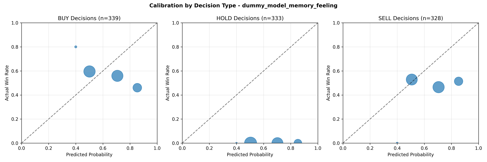

# Calibration Analysis Report - dummy_model_memory_feeling

## Overview

This report analyzes the calibration quality of the **dummy_model_memory_feeling** model, 
measuring how well predicted probabilities match actual outcomes.

---

## Overall Calibration Metrics

**Total Trading Days:** 500
**Overall Win Rate:** 32.2%
**Mean Predicted Probability:** 65.7%

### Calibration Quality Indicators

- **Expected Calibration Error (ECE):** 33.6%
- **Maximum Calibration Error:** 52.3%
- **Overconfidence Score:** 48.0%

- **Calibration Quality:** **POOR** - Model shows significant calibration problems

### Confidence Assessment

- **Assessment:** **OVERCONFIDENT** - Model tends to be too optimistic about success probability

---

## Calibration by Decision Type

This analysis shows if the model has different calibration characteristics for BUY, HOLD, and SELL decisions.

### BUY Decisions

- **Count:** 164 decisions
- **Actual Win Rate:** 51.2%
- **Mean Predicted Probability:** 65.4%
- **Overconfidence:** +14.2% (overconfident)

### HOLD Decisions

- **Count:** 173 decisions
- **Actual Win Rate:** 23.1%
- **Mean Predicted Probability:** 66.5%
- **Overconfidence:** +43.3% (overconfident)

### SELL Decisions

- **Count:** 163 decisions
- **Actual Win Rate:** 47.2%
- **Mean Predicted Probability:** 65.0%
- **Overconfidence:** +17.8% (overconfident)

---

## Recommendations

- **Calibration training needed:** Consider recalibrating the model using techniques like isotonic regression or Platt scaling
- **Overconfidence detected:** Model predictions are too optimistic. Consider adjusting confidence thresholds or using ensemble methods
- **Overconfidence in BUY, HOLD, SELL decisions:** Consider more conservative thresholds for these actions

---

## Visualizations

