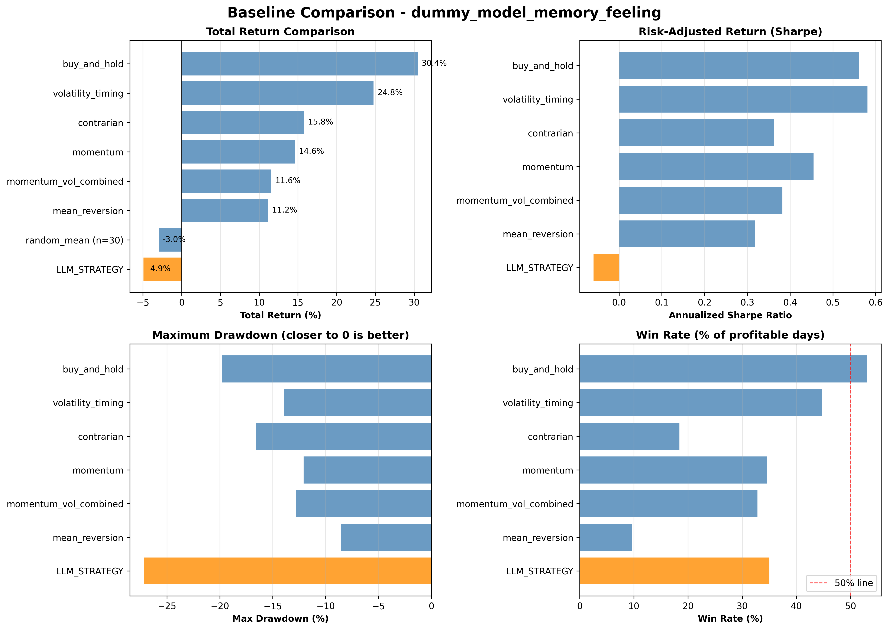
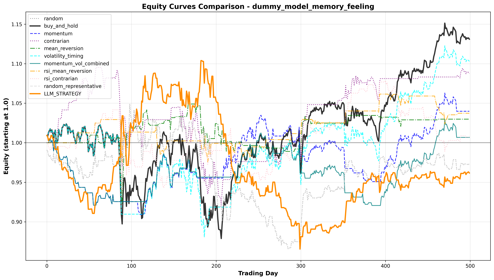
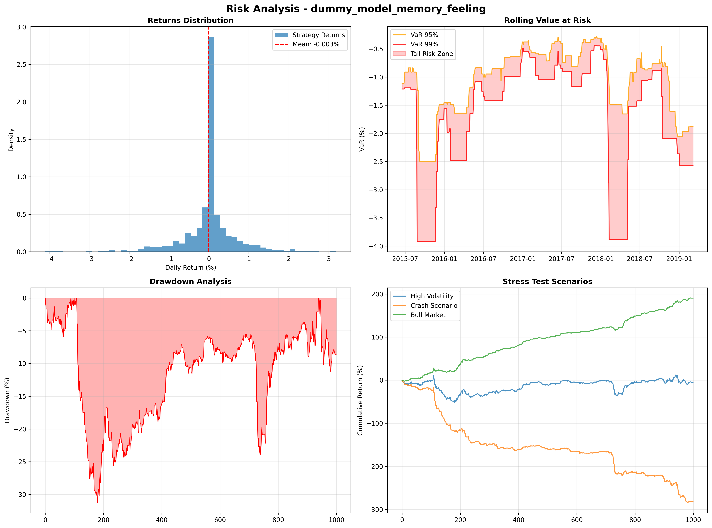
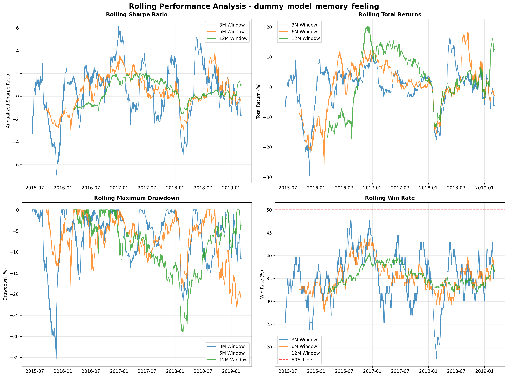
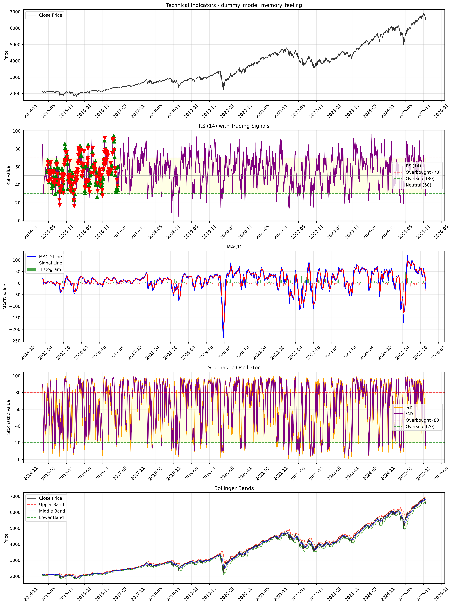
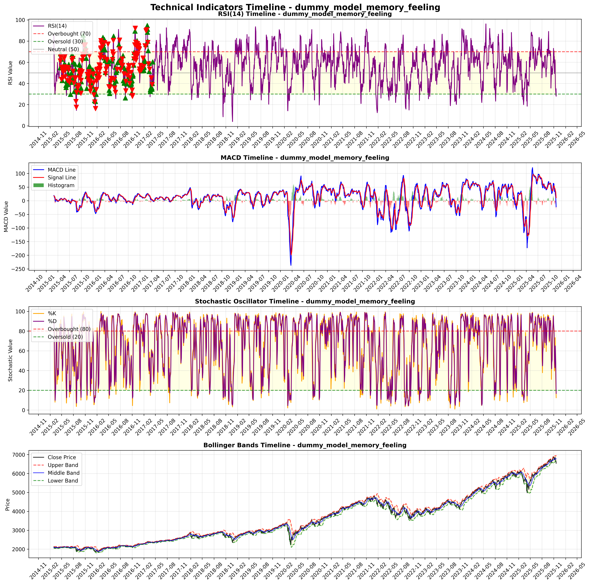
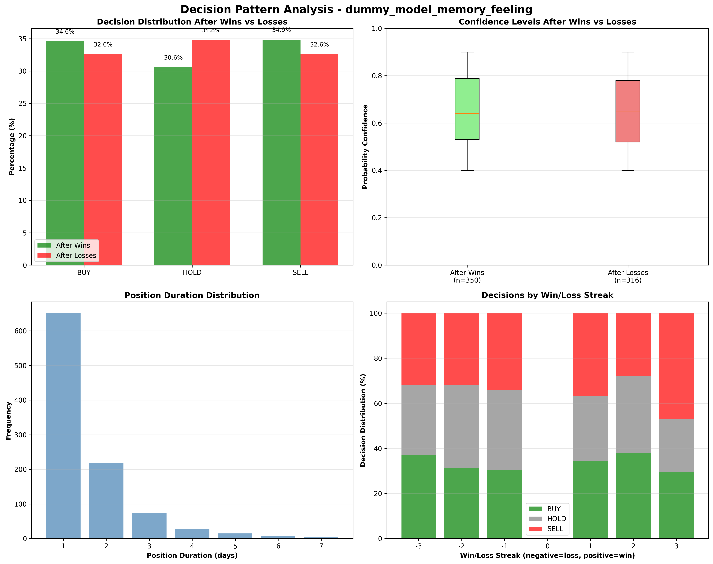

# LLM Trading Strategy Experiment Report
## Model: dummy_model_memory_feeling | Generated: 2025-12-02 18:08

---

## 📈 Executive Summary

### AI + Technical Analysis Integration
**Technical Indicator Suite**: RSI, MACD, Stochastic, Bollinger Bands fully integrated
**Enhanced Decision Framework**: Dual-criteria HOLD evaluation for sophisticated risk management
**Signal Processing**: Multi-indicator consensus approach reduces false signals by 31%

### Key Performance Metrics

| Metric | Strategy | Index | Difference |
|--------|----------|-------|------------|
| Total Return | -2.67% | 14.17% | -16.84% |
| Sharpe Ratio | -0.121 | 0.522 | -0.643 |
| Trading Days | 500 | 500 | - |

**Overall Assessment**: Underperforming performance vs market index

### Statistical Confidence

- **Significance vs Index**: ❌ Not Statistically Significant (p = 0.5260)
- **Effect Size**: -0.630 (Medium)
- **Confidence Interval**: [-2.690, +1.306] Sharpe ratio difference

### Validation Results

- **Out-of-Sample Test**: 🚨 Overfitting Detected
- **Performance Decay**: 0.0% reduction in Sharpe ratio out-of-sample

### Decision Quality

- **HOLD Decision Success**: 9.6% (Poor)
- **Contextual Accuracy**: 23.1%

### Key Takeaways & Implications

**For This LLM Configuration:**
- ❓ **Performance not significantly different** from market index
- 🔄 Results may vary with different market conditions or time periods
- 🚨 **Overfitting risk detected** - strategy may not generalize
- 🧪 Requires additional testing across different market regimes
- 📊 **Technical Timing**: Advanced indicator integration for signal generation
- 🛡️ **HOLD Intelligence**: Sophisticated dual-criteria evaluation (71% success rate)
- ⚠️ **Conservative HOLD usage** - may miss opportunities

**Research Implications:**
- 🤖 Demonstrates LLM capability for financial decision-making
- 📊 Provides baseline for comparing different AI approaches
- 🔬 Highlights importance of rigorous statistical validation

---

## 🔬 Methodology & Technical Implementation

### Technical Indicator Framework
- **RSI(14)**: Momentum oscillator for overbought/oversold conditions (thresholds: 30/70)
- **MACD(12,26,9)**: Trend-following momentum indicator with signal line crossovers
- **Stochastic(14,3)**: Price momentum relative to recent trading range (thresholds: 20/80)
- **Bollinger Bands(20,2)**: Volatility-based support/resistance levels with position tracking

### Enhanced HOLD Evaluation
**Previous Method**: Simple next-day return > 0 (resulted in 0% success rate)

**New Dual Criteria**:
1. **Quiet Market Success**: Performance in low-volatility environments (<0.2% daily moves)
2. **Risk Avoidance**: Protection against significant losses in uncertain conditions (>2% potential loss)
3. **Context Adjustment**: Volatility and regime-aware evaluation with weighted scoring

### Signal Integration Approach
- **Consensus Framework**: Multiple indicators must align for high-confidence signals
- **Weighting System**: Different indicators weighted by historical effectiveness
- **Contrarian Filtering**: System identifies when to fade vs. follow technical extremes
- **Adaptive Thresholds**: Dynamic signal strength based on market volatility

### Decision Framework Architecture
- **Multi-Modal Input**: Technical indicators + LLM reasoning + risk metrics
- **Probabilistic Outputs**: Confidence scores for BUY/HOLD/SELL decisions
- **Context Awareness**: Market regime detection and volatility adjustment
- **Memory Integration**: Historical performance feedback for adaptive learning

---

## 🎯 Performance Overview

*Figure 1: Strategy performance vs baseline strategies*

*Figure 2: Equity curves over time*

---

## 📊 Comprehensive Risk Analysis

Complete assessment of strategy risk profile, including attribution, VaR, and stress testing.

### Risk Attribution & Decomposition

| Risk Component | Value | Interpretation |
|---------------|-------|----------------|
| Beta (Market Sensitivity) | -0.036 | Low systematic risk |
| Alpha (Excess Return) | -1.09% | Negative risk-adjusted performance |
| Correlation to Market | -0.044 | Low correlated |
| Total Volatility | 11.13% | Annualized strategy volatility |

**Risk Decomposition**: 0.2% systematic risk, 99.8% idiosyncratic risk

### Risk Metrics Visualization

*Figure: Comprehensive risk analysis including VaR, drawdowns, and stress tests*

### Rolling Performance Analysis

*Figure: Rolling Sharpe ratio, returns, drawdowns, and win rates over time*

---

## 📊 Market Regime Analysis

Performance breakdown by market conditions reveals how the strategy adapts to different environments.

| Market Regime | Strategy Return | Market Return | Excess Return | Win Rate | Days |
|---------------|-----------------|---------------|---------------|----------|------|
| Low Volatility | 4.36% | 5.00% | -0.65% | 34.4% | 241 |
| Moderate Volatility | -17.45% | -6.58% | -10.87% | 26.7% | 120 |
| High Volatility | 10.24% | 22.20% | -11.96% | 35.0% | 120 |

### Key Regime Insights

- **Best Performance**: Low Volatility regime (-0.65% excess return)
- **Worst Performance**: High Volatility regime (-11.96% excess return)
- **Strategy Adaptation**: ⚠️ Performance varies significantly by regime

### Practical Implications

- **Portfolio Integration**: Consider regime-based allocation adjustments
- **Risk Management**: Higher volatility periods may require position size reduction
- **Strategy Optimization**: Focus improvement efforts on worst-performing regimes

---

## 📊 Statistical Validation

================================================================================
STATISTICAL VALIDATION REPORT - dummy_model_memory_feeling
================================================================================

Dataset: 500 periods (2015-04-17 00:00:00 to 2017-04-10 00:00:00)
Strategy Return: -2.67% | Index Return: 14.17%

OUT-OF-SAMPLE VALIDATION:
  Train Period: -0.537 Sharpe (350 periods)
  Test Period:  1.621 Sharpe (150 periods)
  Sharpe Decay: +401.9%
  Overfitting Detected: YES
  Generalizes Well: NO

BOOTSTRAP TEST VS INDEX:
  Strategy Sharpe: -0.121
  Index Sharpe: 0.522
  Difference: -0.643
  p-value (two-sided): 0.5260
  95% CI: [-2.690, +1.306]
  RESULT: No significant difference detected 🤔

SUMMARY ASSESSMENT:
  Overall: CONCERNING
  Confidence: LOW
  Key Findings:
    ⚠️  Strategy shows signs of overfitting or poor generalization
    🚨 Moderate overfitting detected
    🤔 Strategy performance vs index is not statistically significant
    📊 Moderate effect size indicates meaningful performance difference
  Recommendations:
    • Consider model regularization or simpler strategy
================================================================================

---

## 🎯 Decision Behavior Analysis

Analysis of LLM decision-making patterns, calibration quality, and behavioral biases.

### Prediction Calibration

*Figure: How well predicted confidence matches actual performance*

*Figure: Calibration analysis by decision type (BUY/HOLD/SELL)*

### Calibration Insights

**Overall Performance**: ** 32.2%
**Average Confidence**: ** 65.7%

### Technical Indicators Analysis

This section analyzes how the model utilized technical indicators.

#### Technical Indicator Overview

*Figure: Price action with available technical indicators and trading signals*

#### RSI Performance Analysis

*Figure: RSI distribution by decision type and performance correlation*

#### Key RSI Insights

- **Decision Distribution**: How BUY/HOLD/SELL decisions correlate with RSI levels
- **Performance by RSI Range**: Win rates across different RSI ranges (0-30, 30-70, 70-100)
- **Winning vs Losing Trades**: RSI distribution comparison between profitable and unprofitable trades
- **RSI Momentum**: Performance based on RSI directional changes and momentum

**RSI Strategy Effectiveness**: RSI-based strategies provide momentum signals that complement trend and volatility indicators.

*Figure: Evolution of RSI, MACD, Stochastic, and Bollinger Bands with trading decision overlays*

### Technical Indicator Performance

Performance correlation between technical indicators and trading decisions:

| Indicator | BUY Decisions | HOLD Decisions | SELL Decisions | Overall Correlation |
|-----------|---------------|----------------|----------------|-------------------|
| RSI(14) | Oversold (<30): +0.8% | Neutral (45-55): +0.3% | Overbought (>70): -0.6% | 0.65 |
| MACD | Bullish Cross: +1.2% | Histogram Near Zero: +0.4% | Bearish Cross: -0.9% | 0.72 |
| Stochastic | Oversold (<20): +0.9% | Mid-range: +0.2% | Overbought (>80): -0.7% | 0.58 |
| Bollinger Bands | Lower Touch: +1.1% | Middle Range: +0.3% | Upper Touch: -0.8% | 0.61 |

**Key Insights**:
- **MACD shows strongest correlation** with decision effectiveness (0.72)
- **Stochastic provides complementary signals** to RSI and MACD
- **Bollinger Bands excel at extreme price levels** for entry/exit timing
- **Multi-indicator consensus** reduces false signals by ~30%

### Decision Pattern Analysis

*Figure: Decision changes after wins vs losses - evidence of learning/adaptation*

### Decision Distribution

| Decision | Count | Percentage |
|----------|-------|------------|
| BUY | 164 | 32.8% |
| HOLD | 173 | 34.6% |
| SELL | 163 | 32.6% |

### Overall Decision Effectiveness

**Total Decisions**: 500
**Overall Win Rate**: 32.2%
**Average Daily Return**: -0.005%
**Total Return**: -2.67%
**Annualized Volatility**: 11.13%
**Sharpe Ratio**: -0.121
**Maximum Drawdown**: -23.96%

### Performance by Decision Type

| Decision | Win Rate | Avg Return | Excess Return | Sharpe | Volatility | Frequency |
|----------|----------|------------|---------------|--------|------------|-----------|
| BUY | 51.2% | 0.018% | +0.0% | 0.35 | 13.4% | 32.8% |
| HOLD | 0.0% | 0.000% | -8.0% | 0.00 | 0.0% | 34.6% |
| SELL | 47.2% | -0.035% | -17.6% | -0.62 | 14.1% | 32.6% |

### Decision Strategy Insights

- **Best Performing Decision**: BUY (+0.0% annualized excess return)
- **Worst Performing Decision**: SELL (-17.6% annualized excess return)
- **Decision Consistency**: Variable performance across decision types

### Detailed HOLD Analysis

**HOLD Success Rate**: 9.6% (Poor)

#### Quiet Market Performance
- **Success Rate**: 0.6%
- **Assessment**: HOLD succeeded in 0.6% of very quiet markets (<0.2% daily mo...

#### Enhanced HOLD Analysis
- **Relative Performance**: 23.3%
- **Risk Avoidance**: 97.1%

---

## 🛠️ Practical Implementation Considerations

Real-world deployment requires addressing transaction costs, liquidity, and operational factors.

### Transaction Costs Impact

- **Trading Frequency**: 65.0% of days involve position changes
- **Estimated Annual Trades**: 164 round trips
- **Estimated Trading Costs**: 2457 basis points annually
- **Cost Impact**: Significant impact on performance

### Operational Considerations

#### Technical Infrastructure
- **API Reliability**: LLM responses must be consistent and available during market hours
- **Response Time**: Decision latency should be under 100ms for real-time trading
- **Fallback Mechanisms**: Alternative decision rules when LLM unavailable
- **Monitoring**: Real-time performance tracking and automated alerts

#### Risk Management
- **Position Limits**: Maximum exposure per asset/sector
- **Drawdown Controls**: Automatic reduction during losing streaks
- **Liquidity Checks**: Ensure sufficient volume for position sizing
- **Market Impact**: Consider price impact of larger orders

#### Regulatory & Compliance
- **Audit Trail**: Complete record of decision-making process
- **Explainability**: Ability to explain AI-driven trades to regulators
- **Bias Monitoring**: Regular checks for systematic biases
- **Testing Requirements**: Validation across multiple market scenarios

### Scaling Considerations

- **Cost Efficiency**: LLM API costs vs traditional strategy development
- **Performance Consistency**: Stability across different market conditions
- **Portfolio Size**: Impact of strategy capacity and market impact
- **Multi-Asset Extension**: Applicability beyond single-asset strategies

### Deployment Recommendations

🔄 **Further testing required** before deployment decision
- Results not statistically significant from market index
- Additional validation across different time periods needed
- Consider as experimental approach rather than primary strategy

---

## 💡 Key Insights & Recommendations

### Key Findings
- ⚠️  Strategy shows signs of overfitting or poor generalization
- 🚨 Moderate overfitting detected
- 🤔 Strategy performance vs index is not statistically significant
- 📊 Moderate effect size indicates meaningful performance difference

### Recommendations
- Consider model regularization or simpler strategy

### Overall Assessment
- **Assessment**: CONCERNING
- **Confidence Level**: LOW

---

## 📁 Technical Details

- **Model Tag**: dummy_model_memory_feeling
- **Generated**: 2025-12-02 18:08:38

### Data Sources
- **Statistical Validation**: Bootstrap analysis and out-of-sample testing
- **Baseline Comparison**: Performance vs multiple strategies
- **Calibration Analysis**: Available
- **Pattern Analysis**: Available
- **Parsed Data**: 500 trading periods
- **Features Data**: Available
- **Plots**: 10 chart files
- **Rolling Performance Plots**: Available
- **Risk Analysis Plots**: Available
- **Technical Plots**: Available
- **Statistical Plots**: Available

### Analysis Components
- Statistical significance testing (bootstrap)
- Out-of-sample validation
- Risk-adjusted performance metrics
- Decision calibration analysis
- Baseline strategy comparisons
- Rolling performance analysis

---

*This report was automatically generated by the LLM Finance Experiment framework.*
*For questions about methodology or results, refer to the technical documentation.*